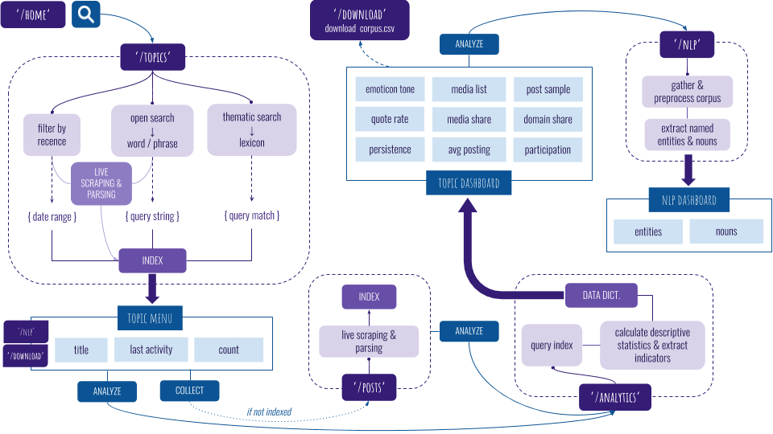
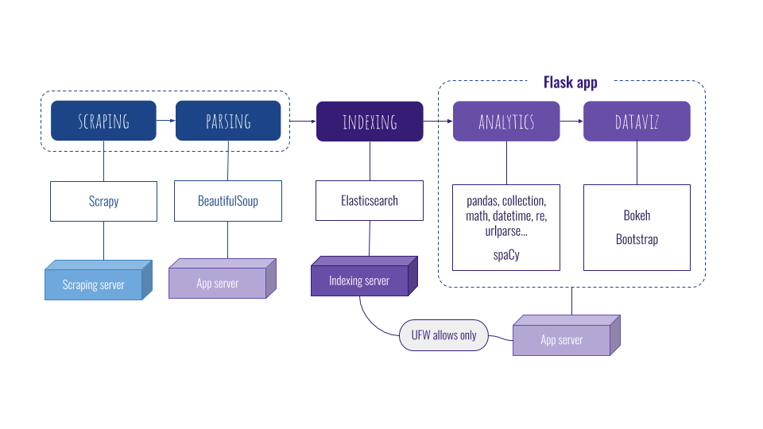

# Agor@phon
A Flask application to analyze activity on an online forum, using scraping, indexing, analytics and NLP.

* [Objectives](#objectives)
* [How it works](#how-it-works)
* [Technical requirements](#technical-requirements)
* [Status](#status)
* [Contributing](#contributing)
* [Authors](#authors)
* [License](#license) 


## Objectives

The Agor@phon Project is intended at creating a web application that enables the collection and analysis of contents published on an online discussion forum. 

The project pursues a scientific and societal objective: to contribute to the knowledge of natural language for machine learning purposes and to provide real-world materials for studying phenomena such as disinformation and hate or extremist speech.

### NLP / linguistic application

The content collected will make it possible to build real-world textual corpora in French, which are rare compared with English ones. This is all the more a valuable resource that, on the forum studied here, the language is of a very oral and slang style, with idioms specific to its user community. That kind of communication is a pain for natural language processing systems which algorithms are mainly trained on texts written by professionals (e.g. press articles) and / or to be read by the greatest number (e.g. Wikipedia).

### Disinformation and hate speech investigation

The data sets obtained will also allow the study of phenomena such as fake news and trolls as well as extremist and / or hate speech for which any online communication platform may be fertile ground. What makes the type of forums studied here a little bit different is that users can register truly anonymously - no phone number or verified professional email to provide, which facilitates opportunistic or impulsive interventions, whether to launch or to participate in a discussion. Also, the desire to build and maintain any community of followers is out of concern for most of users. Unlike other platforms where family, friends and colleagues may identify them, they can post freely without worrying about their reputation. And when social desirability is not at stake, anything goes…

It should be noted that, on this research subject too, large French corpora are few or else concentrated on easily accessible deposits (e.g. Twitter).

A preliminary exploratory study has shown that the forum is a place of convergence of different kinds of sources, whether social networks, micro-blogging and videos or images sharing platforms, information sites, or even messaging such as Telegram or Whatsapp which screenshots can be found shared by users. Thus the forum opens on a wider spectrum than itself and offers materials that enable to catch social trends.


## How it works




## Technical requirements

The app is built with Flask framework 1.1 and written in Python 3.8.

One can use the package manager [pip](https://pip.pypa.io/en/stable/) to install the whole required libraries.

```bash
pip install -r requirements.txt
```

The whole system is based on a distributed architecture where 3 different servers communicate: the first being in charge of collecting the scraped sources, the second of indexing the parsed content, and the third one hosting the app where analytics and NLP are implemented.

## Status

This project is in progress.


## Contributing

Pull requests are welcome. For major changes, please open an issue first to discuss what you would like to change.

Please make sure to update tests as appropriate.


## Authors

- Initial work: Stephanie BLANCHET, Data and Application Pythonist.
- Contact: stephanie.blanchet.it@gmail.com


## License

This project is licensed under the MIT License - see [MIT](https://choosealicense.com/licenses/mit/) for details.
